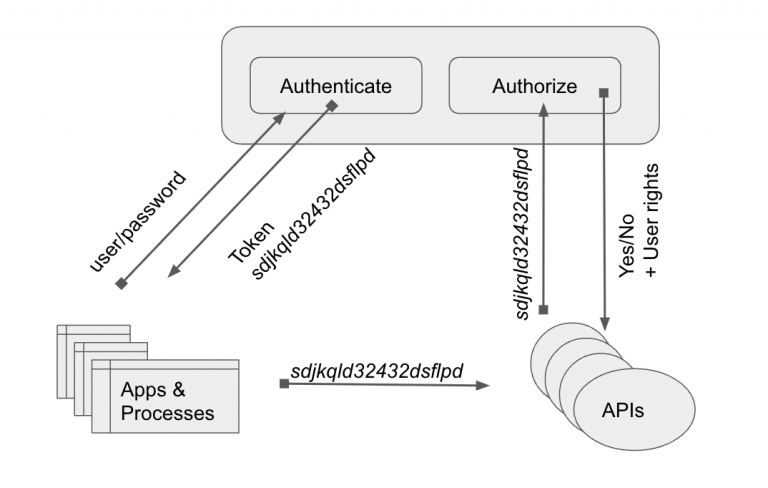

# Microservice Overview and Instructions

A microservices architecture offers several advantages over a monolithic application. With microservices the overall application is broken up into distinct services. This design allows for:
- Scaling of each microservice differently, such as search, payments, data science, etc.
- Separation of concerns
- Each team can work independently on their domain
- Mix of technologies - e.g., each service can be independently composed of Django, Flask, FastApi, Falcon, Javascript/Node etc.

# Microservices Architecture

Central to a microservices architecture is the authentication layer, which is needed for authentication, authorization, and provides overall identity access management.

Users are authenticated by tokens issued by the authentication layer. When a user logs in, the auth layer generates a signed token and returns it to the client. 

For every service that the client seeks to access, each microservice verifies the signature of the JWT token by using the same secret provided to sign the token. This verification is automatically done by Auth0, such that the secret key does not have to be distributed to every service.  

# Install
To run the auth0 framework, make sure you have `python3` and `pip` installed.

Rename `.env.example` to `.env` and populate it with the client ID, domain, secret, callback URL and audience for your Auth0 app. 

Once those variables are set, run 

`pip install -r requirements.txt` to install the dependencies and run `python server.py`.

The app will be served at [http://localhost:3000/](http://localhost:3000/).

# Running the App with Docker

To run the sample, make sure you have `docker` installed.

To run the sample with [Docker](https://www.docker.com/), make sure you have `docker` installed.

Rename the .env.example file to .env, change the environment variables, and register the URLs as explained [previously](#running-the-app).

Run `sh exec.sh` to build and run the docker image.

## What is Auth0?

Auth0 helps you to:

* Add authentication with [multiple authentication sources](https://auth0.com/docs/identityproviders),
either social like **Google, Facebook, Microsoft Account, LinkedIn, GitHub, Twitter, Box, Salesforce, among others**,or
enterprise identity systems like **Windows Azure AD, Google Apps, Active Directory, ADFS or any SAML Identity Provider**.
* Add support for **[linking different user accounts](https://auth0.com/docs/link-accounts)** with the same user.
* Support for generating signed [JSON Web Tokens](https://auth0.com/docs/jwt) to call your APIs and
**flow the user identity** securely.
* Analytics of how, when and where users are logging in.
* Pull data from other sources and add it to the user profile, through [JavaScript rules](https://auth0.com/docs/rules).

